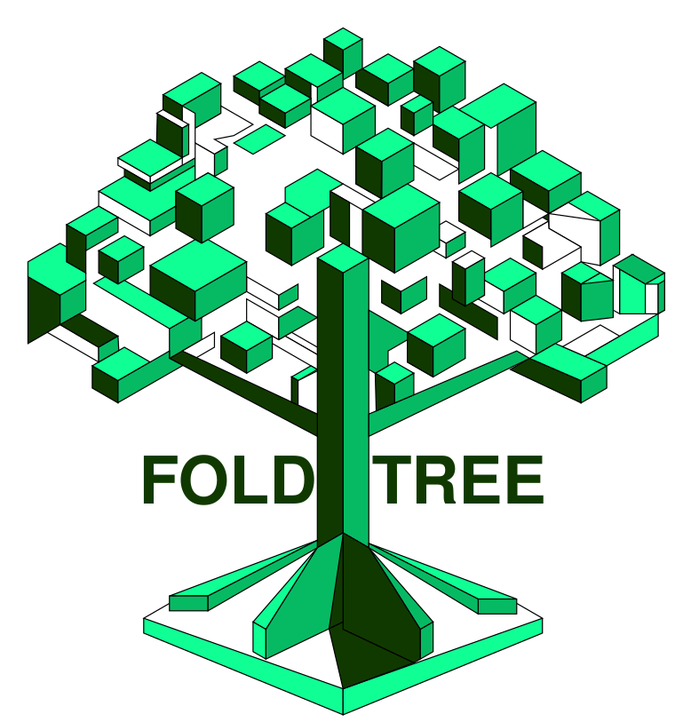

# Snakemake workflow: `fold_tree`
[](https://snakemake.github.io)

This repo contains the scripts and snakemake workflow for making and benchmarking structure based trees using Foldseek.

It's associated with the manuscript located at #


## Running the pipeline

First, install snakemake. Instructions are available here.

https://snakemake.readthedocs.io/en/stable/getting_started/installation.html


Next we need to clone the repo and execute the workflow.

```
git clone git@github.com:DessimozLab/fold_tree.git
cd fold_tree
```

Now create a conda environment for foldtree with all of the required software to avoid creating many environments ( and lots of files ).
We can use the yaml file found in the workflow configuration. 

```
mamba create -n foldtree --file= ./workflow/config/fold_tree.yaml
mamba activate foldtree
```
Now we're ready to run the workflow.
First we set up a folder which will contain the results. Here we call it myfam.

```
mkdir myfam
```

Now we can either create a text file with the uniprot identifiers of the structures we would like to inlcude in the tree or provide a precompiled set of structures (useful if the structures are not in the AlphaFold DB). In the use case of precompiled sets of structures, create a structs folder in the myfam directory and place all of your structures ( in pdb format ) in this folder and leave the identifier file blank.

```
mkdir myfam/structs
```

Foldtree will automatically fetch the protein structures that are available from AlphFold DB. All we need to do now is run the workflow. In our example we use 4 cores. We also have the option of filtering out structures with an average PLDDT lower than 40. This was shown to improve the quality of trees relative to sequence trees ( see the manuscript). Here we turn this option off to allow all structures in the tree.

```
snakemake --cores 4 --use-conda -s ./workflow/fold_tree --config folder=./myfam filter=False 

```

If we have a custom set of structures we use the following command and leave the identifier file blank.

```
snakemake --cores 4 --use-conda -s ./workflow/fold_tree --config folder=./myfam filter=False custom_structs=True

```

The Foldtree metric (Fident), LDDT and TM trees are output alongside some information retreived fromt the uniprot API on the proteins, foldseek comparisons, distance matrices and descriptors of the pLDDT of the structures.


## Repo table of contents

In the examples folder you can find the data we used to make the RRNPPA phylogeny which is presented in detail in the manuscript as a motivating case study alongside other case studies.

In the notebooks folder there are jupyter notebooks used to collect and plot the results of the benchmarking experiments we performed as well as generate the RRNPPA phylogeny.

The src folder contains python code used to interact with the Uniprot and Alphafold databases as well as building structural.


## Benchmarking experiments

To rerun the benchmarking experiments use the benchmarking workflow. This should be done on a cluster environment since thousands of trees will be generated. We performed experiments on a slurm cluster and the slurmsimple module is included in this repo to allow snakemake to schedule jobs. Other cluster approaches to using snakemake on a cluster should also work. The benchmarking pipeline will output 4 types of trees for sequence-based analysis for each family using 2 possible aligners ( muscle5 or clustalo ) and 2 possible tree building approaches ( iqtree of fasttree). The pipeline also output 12 structural trees for each family. These either use only 3di or 3di and amino acid alignments, 3 different strutural distances ( Fident or Foldtree metric, LDDT and TM score) and with or without statistical correction. The trees are then rooted with MAD and scored using ultrametricity and taxonomic congruence metrics.

To rerun the OMA HOG experiments download the identifier data from zenodo. (###)

Then unzip the archives to create the folder structure

Then use snakemake on each directory of the data. Here we only derive trees for families starting at the LUCA level.

```
snakemake  --profile slurmsimple/simple --use-conda -s ./workflow/Benchmarking_workflow --directory  ./path/to/your/data/OMA_data/LUCA
```

To rerun the CATH/CAT experiments you will need to install openMM to deal with discontinuous structures and the Pebble multiprocessing librarx. These packages can be install in the foldree environment

Let's activate the environment and install openmm, pdbfixer and pebble

```
mamba activate foldtree
mamba install -c conda-forge openmm
mamba install -c conda-forge pdbfixer
mamba install pebble
```

Now we can run the data preparation script

```
python ./src/dataprep/prepare_protsets_CATH.py
```

This will set up folders for each family at the CAT and CATH levels, download PDB files for each of the families and correct them using PDBfixer from OpenMM.
Now you can run the workflow on the CATH or CAT dataset in the same way we did with the OMA dataset.

```
snakemake  --profile slurmsimple/simple --use-conda -s ./workflow/Benchmarking_workflow --directory  ./path/to/your/data/CATH_data/
```

The code to generate the figures from the manuscript is available in the notebooks folder of the repo. 